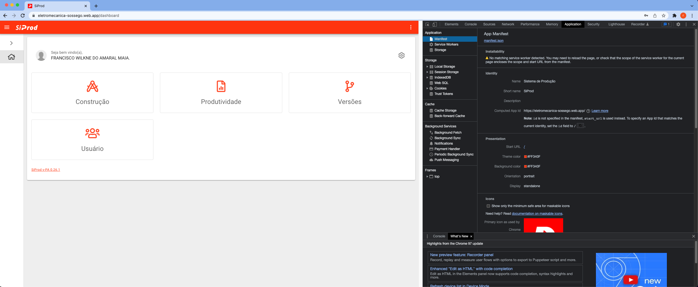
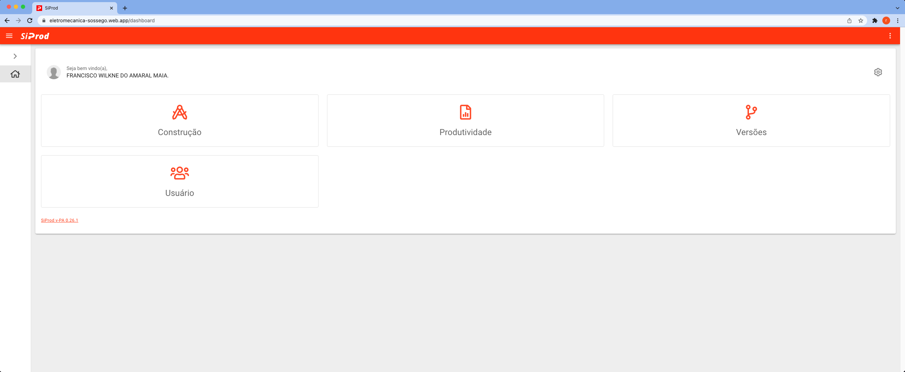

# Limpar dados de navegação no chrome

1. Abra o sistema [siprod.com](https://eletromecanica-sossego.web.app).

2. Com o navegador do Google Chrome pressione a tecla "F12" ou no canto superior direito e clique nos três pontos verticais. Repouse o cursor sobre "Mais ferramentas" e selecione "Ferramentas de desenvolvedor".

3. Após a abertura do painel, clique na aba "Application". Se não vir a opção, selecione o ícone `">>"` para revelar guias ocultas e então escolha `"Application"`.

4. No menu lateral esquerdo, selecione `"Clear storage"` em seguida, pressione o botão `"Clear site data"`.

5. Para finalizar atualize o navegador e faça o login novamente.

