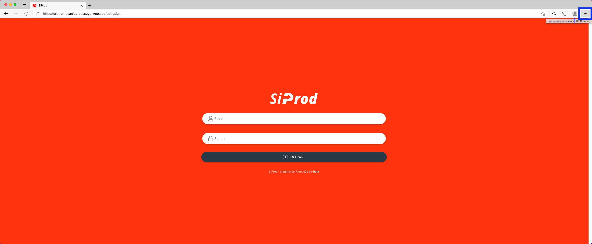
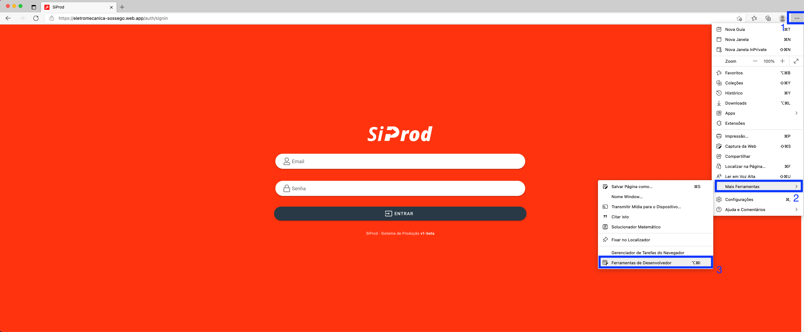
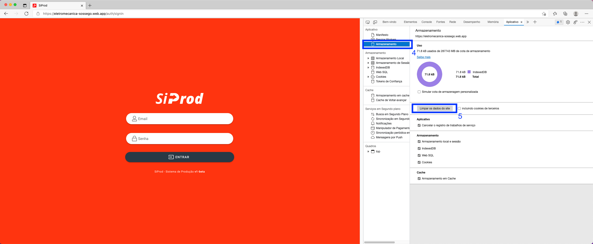
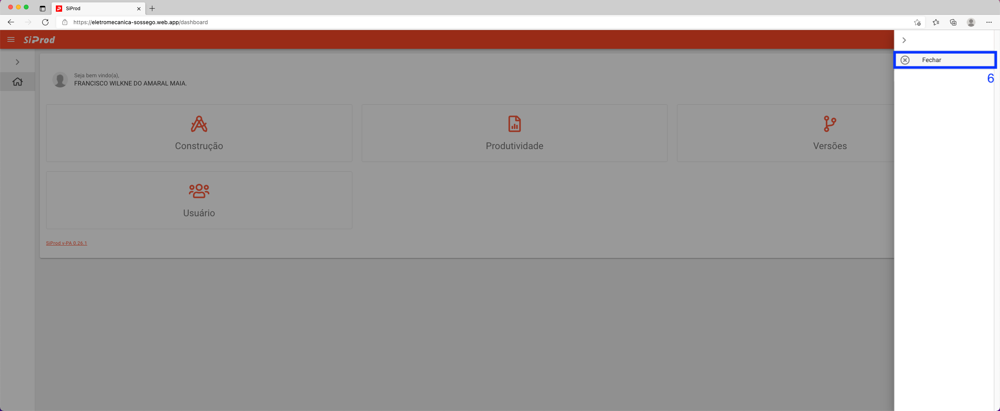

# Limpar dados de navegação no Edge

1. Abra o sistema [siprod.com](https://eletromecanica-sossego.web.app).

2. Com o navegador do Edge pressione a tecla "F12" ou no canto superior direito e clique nos três pontos verticais.

3. Repouse o cursor sobre "Mais ferramentas" e selecione "Ferramentas de desenvolvedor".

4. No menu lateral esquerdo, selecione `"Armazenamento"` em seguida, pressione o botão `"Limpar dados do site"`.

5. Para finalizar atualize o navegador e faça o login novamente.

>Se não vir a opção `"Aplicativo"`, selecione o ícone`">>"` para revelar guias ocultas.
