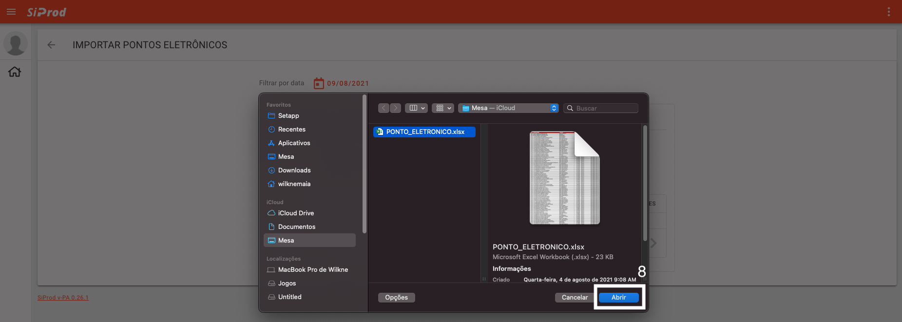

# Ponto Eletrônico

1. Acesse o sistema [siprod_diurno](https://eletromecanica-sossego.web.app) | [siprod_noturno](https://manut-ind-paradao-cks.web.app/construction).
2. Preencha os campos: `E-mail` e `Senha`. Clique no botão `ENTRAR`.  
3. Clique no cartão `Construção`.  
4. Clique no cartão `Ponto Eletrônico`. 
5. Clique no botão no canto inferior direito. 
6. Selecione o ano referente ao ponto eletrônico. 
7. Selecione o arquivo que contém o ponto eletrônico. 
8. Clique no botão `Abrir`. 
9. Clique no botão `Importar`. 

!!! warning "Atenção"
    Se tiver `Ponto Eletrônico` cadastrado nesta data, primeiro deve-se excluir o `Ponto Eletrônico` antes de cadastrar um novo!
