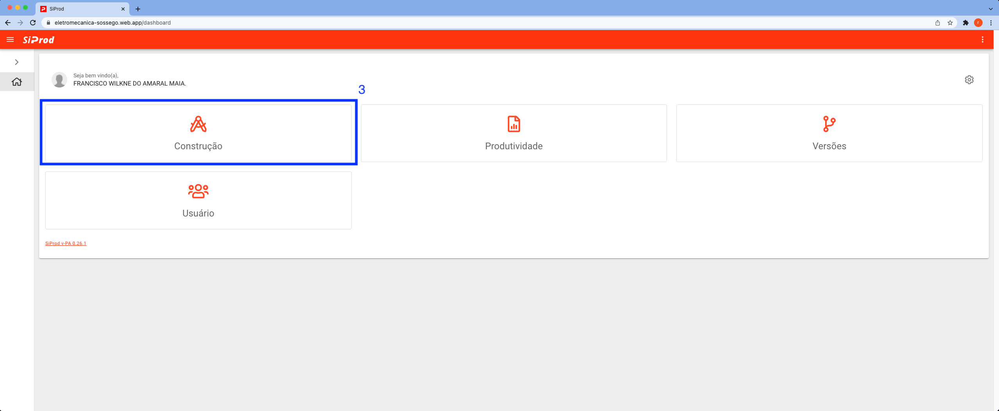

# LS | OS

1. Acesse o sistema [siprod_diurno](https://eletromecanica-sossego.web.app) | [siprod_noturno](https://manut-ind-paradao-cks.web.app/construction).
2. Preencha os campos: `E-mail` e `Senha`. Clique no botão `ENTRAR`.  
3. Clique no cartão `Construção`.  
4. Clique no cartão `LS`.  
5. Clique no botão `+` no canto inferior direito. 
6. Preencha os campos obrigatórios: `LS`, `CC Projeto`, `Local`, `Área`, `Discrição`, `Status` deixe Ativo. Clique no botão `SALVAR`. 
